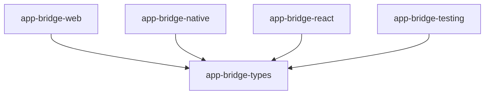

# Package Split Strategy

## Progress Update

### ✅ Completed
1. Created new package structure
2. Implemented React package (`@open-game-system/app-bridge-react`)
   - Moved React components and hooks
   - Updated imports and dependencies
   - Tests passing
3. Set up package.json files for all packages
4. Set up TypeScript configurations
5. Set up testing infrastructure with Vitest
6. Implemented testing utilities package (`@open-game-system/app-bridge-testing`)
7. Set up CI/CD pipeline with GitHub Actions
8. Implemented native package (`@open-game-system/app-bridge-native`)
   - Moved native bridge implementation
   - Added proper types and interfaces
   - Tests passing

### 🚧 In Progress
1. Updating example apps to use new package structure

### ⏳ Pending
1. Documentation updates for new package structure
2. Final integration testing
3. Publishing setup for all packages

## 1. New Package Structure

We'll split into these packages:
- `@open-game-system/app-bridge-types`: Core type definitions
- `@open-game-system/app-bridge-web`: Web-specific implementation
- `@open-game-system/app-bridge-native`: React Native specific code
- `@open-game-system/app-bridge-react`: React hooks and components
- `@open-game-system/app-bridge-testing`: Testing utilities

## 2. Package Dependencies



## 3. Package Contents

### @open-game-system/app-bridge-types
```typescript
// Core type definitions
export type State = object;
export type Event = { type: string };
export type Store<TState, TEvent> = {...};
export type BridgeStores = Record<string, { state: State; events: Event }>;
```

### @open-game-system/app-bridge-web
```typescript
import type { BridgeStores } from '@open-game-system/app-bridge-types';
export { createWebBridge } from './web-bridge';
```

### @open-game-system/app-bridge-native
```typescript
import type { BridgeStores } from '@open-game-system/app-bridge-types';
export { createNativeBridge } from './native-bridge';
```

### @open-game-system/app-bridge-react
```typescript
import type { BridgeStores } from '@open-game-system/app-bridge-types';
export { createBridgeContext } from './context';
export { useStore, useSelector } from './hooks';
```

### @open-game-system/app-bridge-testing
```typescript
import type { BridgeStores } from '@open-game-system/app-bridge-types';
export { createMockBridge } from './mock-bridge';
```

## 4. CI/CD Updates

We'll need to modify the CI workflow to handle multiple package publishing. Here's the detailed plan:

```yaml
name: CI

on:
  push:
    branches: [main]
  pull_request:
    branches: ["**"]

jobs:
  test:
    # ... existing test job ...

  publish-packages:
    needs: test
    runs-on: ubuntu-latest
    strategy:
      matrix:
        package:
          - types
          - web
          - native
          - react
          - testing
    steps:
      - uses: actions/checkout@v3
        with:
          fetch-depth: 0

      - name: Setup Node.js
        uses: actions/setup-node@v3
        with:
          node-version: 18
          registry-url: 'https://registry.npmjs.org'

      - name: Setup pnpm
        uses: pnpm/action-setup@v2
        with:
          version: 8

      - name: Install dependencies
        run: |
          # Install only the specific package we're publishing
          cd packages/app-bridge-${{ matrix.package }}
          pnpm install

      - name: Build package
        run: |
          cd packages/app-bridge-${{ matrix.package }}
          pnpm run build

      - name: Generate version
        id: version
        run: |
          # Package name from package.json
          PACKAGE_NAME=$(node -p "require('./packages/app-bridge-${{ matrix.package }}/package.json').name")
          
          # Extract major version (e.g., "0" or "4")
          MAJOR_VERSION=$(node -p "require('./packages/app-bridge-${{ matrix.package }}/package.json').version.split('.')[0]")
          
          # Generate date in format YYYYMMDD
          DATE=$(date +'%Y%m%d')
          
          # Get current run number for a unique build number
          BUILD_NUMBER=${{ github.run_number }}
          
          # Create a version with format: MAJOR.DATE.0.BUILD
          NEW_VERSION="${MAJOR_VERSION}.${DATE}.0.${BUILD_NUMBER}"
          
          echo "Generated version: $NEW_VERSION"
          echo "NEW_VERSION=$NEW_VERSION" >> $GITHUB_OUTPUT

      - name: Update version in package.json
        run: |
          cd packages/app-bridge-${{ matrix.package }}
          npm version ${{ steps.version.outputs.NEW_VERSION }} --no-git-tag-version

      - name: Copy README and LICENSE
        run: |
          cp README.md packages/app-bridge-${{ matrix.package }}/
          cp LICENSE packages/app-bridge-${{ matrix.package }}/ 2>/dev/null || :
          # Copy docs folder if it exists
          mkdir -p packages/app-bridge-${{ matrix.package }}/docs
          cp -R docs/* packages/app-bridge-${{ matrix.package }}/docs/ 2>/dev/null || :

      - name: Publish package to npm
        env:
          NODE_AUTH_TOKEN: ${{ secrets.NPM_TOKEN }}
        run: |
          cd packages/app-bridge-${{ matrix.package }}
          npm publish --access public
```

### Matrix Strategy Explanation

The `strategy.matrix` configuration in GitHub Actions allows us to run the same job multiple times with different values. In our case:

1. **Matrix Definition**:
   ```yaml
   strategy:
     matrix:
       package:
         - types
         - web
         - native
         - react
         - testing
   ```
   This creates 5 parallel jobs, one for each package.

2. **Matrix Variable Usage**:
   - `${{ matrix.package }}` is replaced with each value in the matrix
   - For example, in the first job it will be "types", in the second "web", etc.
   - This allows us to use the same steps for all packages

3. **Parallel Execution**:
   - All 5 jobs run in parallel
   - Each job handles one package independently
   - If one job fails, others continue running

4. **Job Context**:
   - Each job has its own workspace
   - Each job builds and publishes its own package
   - Dependencies between packages are handled by npm/yarn/pnpm

### Benefits of Matrix Strategy

1. **Parallel Publishing**:
   - All packages publish simultaneously
   - Faster overall CI/CD pipeline
   - Independent success/failure per package

2. **DRY (Don't Repeat Yourself)**:
   - Same steps for all packages
   - Easy to maintain
   - Consistent publishing process

3. **Flexibility**:
   - Easy to add new packages
   - Easy to modify steps for all packages
   - Easy to add package-specific conditions

4. **Visibility**:
   - Clear status per package
   - Easy to identify which package failed
   - Better debugging experience

### Example Workflow

When this workflow runs:
1. The test job runs first
2. After tests pass, 5 parallel publish jobs start
3. Each job:
   - Sets up Node.js and pnpm
   - Installs dependencies for its package
   - Builds the package
   - Generates a version
   - Updates package.json
   - Copies necessary files
   - Publishes to npm

If any package fails to publish, the other packages are unaffected, and you can retry just the failed package.

## 5. Package.json Updates

Each package will need its own package.json. Here's the template:

### app-bridge-types/package.json
```json
{
  "name": "@open-game-system/app-bridge-types",
  "version": "0.1.0",
  "types": "./dist/index.d.ts",
  "sideEffects": false,
  "files": ["dist", "README.md", "LICENSE"],
  "publishConfig": {
    "access": "public"
  }
}
```

### app-bridge-native/package.json
```json
{
  "name": "@open-game-system/app-bridge-native",
  "version": "0.1.0",
  "main": "./dist/index.js",
  "module": "./dist/index.mjs",
  "types": "./dist/index.d.ts",
  "sideEffects": false,
  "files": ["dist", "README.md", "LICENSE"],
  "peerDependencies": {
    "react-native": ">=0.60.0",
    "react-native-webview": ">=11.0.0"
  },
  "dependencies": {
    "@open-game-system/app-bridge-types": "workspace:*"
  },
  "publishConfig": {
    "access": "public"
  }
}
```

## 6. Build Configuration

We'll use tsup for each package with specific configs:

### tsup.config.ts template
```typescript
import { defineConfig } from 'tsup';

export default defineConfig({
  entry: ['src/index.ts'],
  format: ['cjs', 'esm'],
  dts: true,
  splitting: false,
  sourcemap: true,
  clean: true,
  treeshake: true,
  external: ['react', 'react-native', 'react-native-webview']
});
```

## 7. Initial Package Setup

1. Create package directories and READMEs:
```bash
# Create directories
mkdir -p packages/{app-bridge-types,app-bridge-web,app-bridge-native,app-bridge-react,app-bridge-testing}/src

# Create READMEs
touch packages/app-bridge-types/README.md
touch packages/app-bridge-web/README.md
touch packages/app-bridge-native/README.md
touch packages/app-bridge-react/README.md
touch packages/app-bridge-testing/README.md
```

2. Initialize each package with its README content:

### app-bridge-types/README.md
```markdown
# @open-game-system/app-bridge-types

Core type definitions for the app-bridge ecosystem.

## Installation

```bash
npm install @open-game-system/app-bridge-types
# or
yarn add @open-game-system/app-bridge-types
# or
pnpm add @open-game-system/app-bridge-types
```

## Usage

```typescript
import type { State, Event, Store, BridgeStores } from '@open-game-system/app-bridge-types';
```

## API Reference

See the main [API documentation](../docs/API_REFERENCE.md) for details.
```

### app-bridge-web/README.md
```markdown
# @open-game-system/app-bridge-web

Web-specific implementation of the app-bridge.

## Installation

```bash
npm install @open-game-system/app-bridge-web
# or
yarn add @open-game-system/app-bridge-web
# or
pnpm add @open-game-system/app-bridge-web
```

## Usage

```typescript
import { createWebBridge } from '@open-game-system/app-bridge-web';
import type { BridgeStores } from '@open-game-system/app-bridge-types';
```

## API Reference

See the main [API documentation](../docs/API_REFERENCE.md) for details.
```

### app-bridge-native/README.md
```markdown
# @open-game-system/app-bridge-native

React Native specific implementation of the app-bridge.

## Installation

```bash
npm install @open-game-system/app-bridge-native
# or
yarn add @open-game-system/app-bridge-native
# or
pnpm add @open-game-system/app-bridge-native
```

## Peer Dependencies

This package requires:
- react-native >= 0.60.0
- react-native-webview >= 11.0.0

## Usage

```typescript
import { createNativeBridge } from '@open-game-system/app-bridge-native';
import type { BridgeStores } from '@open-game-system/app-bridge-types';
```

## API Reference

See the main [API documentation](../docs/API_REFERENCE.md) for details.
```

### app-bridge-react/README.md
```markdown
# @open-game-system/app-bridge-react

React hooks and components for the app-bridge.

## Installation

```bash
npm install @open-game-system/app-bridge-react
# or
yarn add @open-game-system/app-bridge-react
# or
pnpm add @open-game-system/app-bridge-react
```

## Usage

```typescript
import { createBridgeContext, useStore, useSelector } from '@open-game-system/app-bridge-react';
import type { BridgeStores } from '@open-game-system/app-bridge-types';
```

## API Reference

See the main [API documentation](../docs/API_REFERENCE.md) for details.
```

### app-bridge-testing/README.md
```markdown
# @open-game-system/app-bridge-testing

Testing utilities for the app-bridge ecosystem.

## Installation

```bash
npm install @open-game-system/app-bridge-testing --save-dev
# or
yarn add @open-game-system/app-bridge-testing --dev
# or
pnpm add @open-game-system/app-bridge-testing --save-dev
```

## Usage

```typescript
import { createMockBridge } from '@open-game-system/app-bridge-testing';
import type { BridgeStores } from '@open-game-system/app-bridge-types';
```

## API Reference

See the main [API documentation](../docs/API_REFERENCE.md) for details.
```

## 8. Migration Steps

1. Create new package directories:
```bash
mkdir -p packages/{app-bridge-types,app-bridge-web,app-bridge-native,app-bridge-react,app-bridge-testing}
```

2. Move files to appropriate packages:
```bash
# Types
mv src/types packages/app-bridge-types/src/

# Web implementation
mv src/web packages/app-bridge-web/src/

# Native implementation
mv src/native packages/app-bridge-native/src/

# React hooks and components
mv src/react packages/app-bridge-react/src/

# Testing utilities
mv src/testing packages/app-bridge-testing/src/
```

3. Update imports in all files to use new package names

4. Update example apps to use new packages:
```typescript
// Web app
import { createWebBridge } from '@open-game-system/app-bridge-web';
import { createBridgeContext } from '@open-game-system/app-bridge-react';
import type { BridgeStores } from '@open-game-system/app-bridge-types';

// Native app
import { createNativeBridge } from '@open-game-system/app-bridge-native';
```

## 9. Documentation Updates

1. Update main README to reflect new package structure
2. Create individual README files for each package
3. Update API documentation to show proper imports
4. Update examples to use new package imports

## 10. Testing Strategy (Revised)

### Test Setup Per Package

Each package will maintain its own tests alongside the code being tested, following a co-location principle rather than a centralized `__tests__` directory. This makes it easier to maintain tests and find them when working on related code.

```typescript
packages/
  app-bridge-types/
    src/
      index.ts
      index.test.ts      # Tests co-located with source
      state/
        types.ts
        types.test.ts    # Tests next to implementation
  app-bridge-web/
    src/
      bridge.ts
      bridge.test.ts     # Tests next to implementation
  // ... etc
```

### Vitest Configuration

Each package will have its own Vitest configuration:

```typescript
// vitest.config.ts
import { defineConfig } from "vitest/config";

export default defineConfig({
  test: {
    environment: "jsdom",      // For packages needing DOM
    globals: true,
    include: ["src/**/*.test.{ts,tsx}"],
    coverage: {
      provider: "v8",
      reporter: ["text", "json", "html"],
    },
    deps: {
      inline: ["@testing-library/react", "@testing-library/jest-dom"],
    },
  },
});
```

### Package-Specific Test Plans

1. **app-bridge-types**
   - Type definition tests
   - Type constraint validation
   - Type composition tests
   - Example type usage tests

2. **app-bridge-web**
   - Web bridge initialization
   - Message passing tests
   - State synchronization
   - WebView integration
   - Error handling

3. **app-bridge-native**
   - Native bridge initialization
   - WebView message handling
   - State management
   - Producer function tests
   - Event dispatch tests

4. **app-bridge-react**
   - Hook functionality tests
   - Context provider tests
   - Component integration tests
   - State subscription tests
   - Error boundary tests

5. **app-bridge-testing**
   - Mock bridge implementation
   - Mock store functionality
   - Event history tracking
   - State manipulation utilities
   - Integration with testing frameworks

### Integration Testing Strategy

1. **Cross-Package Integration**
   ```typescript
   // Example: Testing web + react integration
   describe('Web Bridge + React Integration', () => {
     test('React components respond to web bridge events', () => {
       // Setup web bridge
       // Mount React components
       // Dispatch events
       // Verify component updates
     });
   });
   ```

2. **Full Stack Testing**
   ```typescript
   // Example: Testing complete flow
   describe('Full Bridge Stack', () => {
     test('Events flow from web to native and back', () => {
       // Setup native bridge
       // Setup web bridge
       // Setup React components
       // Trigger event chain
       // Verify state propagation
     });
   });
   ```

### Test Scripts Configuration

Each package.json will include:

```json
{
  "scripts": {
    "test": "vitest run",
    "test:watch": "vitest watch",
    "test:coverage": "vitest run --coverage"
  }
}
```

### Development Dependencies

```json
{
  "devDependencies": {
    "vitest": "^1.2.2",
    "@vitest/coverage-v8": "^1.2.2",
    "@testing-library/react": "^14.2.1",
    "@testing-library/jest-dom": "^6.4.2",
    "jsdom": "^24.0.0"
  }
}
```

### Testing Guidelines

1. **Test Organization**
   - Co-locate tests with implementation files
   - Use descriptive test file names
   - Group related tests in describe blocks
   - Use clear test case descriptions

2. **Test Coverage Goals**
   - Minimum 80% coverage for critical paths
   - Full coverage of public APIs
   - Integration test coverage for common use cases

3. **Testing Best Practices**
   - Write isolated tests
   - Mock external dependencies
   - Test edge cases and error conditions
   - Use meaningful assertions

4. **Continuous Integration**
   - Run tests on every PR
   - Enforce coverage thresholds
   - Run integration tests in CI pipeline

## 11. Version Management

1. Use same version across all packages initially
2. Consider independent versioning later if needed
3. Use changesets for version management

## 12. Workspace Configuration

1. Update root package.json to include all new packages:
```json
{
  "workspaces": [
    "packages/*"
  ]
}
```

2. Add shared development dependencies to root:
```json
{
  "devDependencies": {
    "typescript": "^5.3.3",
    "tsup": "^8.0.1",
    "vitest": "^1.2.2",
    "turbo": "^1.12.2"
  }
}
```

3. Configure TypeScript project references in root tsconfig.json:
```json
{
  "references": [
    { "path": "packages/app-bridge-types" },
    { "path": "packages/app-bridge-web" },
    { "path": "packages/app-bridge-native" },
    { "path": "packages/app-bridge-react" },
    { "path": "packages/app-bridge-testing" }
  ]
}
```

## 13. Package Entry Points

Each package should have clear entry points:

### Types Package
- `index.ts` - Type definitions

### Web Package
- `index.ts` - Web bridge implementation
- `webview/index.ts` - WebView specific code

### Native Package
- `index.ts` - Native bridge implementation
- `webview/index.ts` - WebView integration

### React Package
- `index.ts` - Context and hooks
- `components/index.ts` - React components

### Testing Package
- `index.ts` - Mock bridge implementation
- `utils/index.ts` - Testing utilities

## 14. Build Pipeline

1. **Development Workflow**
   - Use `turbo` for parallel builds
   - Configure watch mode for development
   - Set up hot reloading for example apps

2. **Build Scripts**
   ```json
   {
     "scripts": {
       "build": "turbo run build",
       "dev": "turbo run dev --parallel",
       "test": "turbo run test",
       "typecheck": "turbo run typecheck"
     }
   }
   ```

3. **Build Order**
   - Types package must build first
   - Other packages can build in parallel
   - Example apps build last

## 15. Example App Updates

1. **React Web Example**
   - Update to use new package imports
   - Add proper peer dependency handling
   - Update build configuration

2. **React Native Example**
   - Update metro.config.js for proper module resolution
   - Add proper peer dependency handling
   - Update build configuration

3. **Testing Examples**
   - Add examples for each package's testing utilities
   - Show integration testing between packages

## 16. Versioning Strategy

1. **Initial Release**
   - All packages start at same version
   - Use semantic versioning
   - Coordinate releases through changesets

2. **Breaking Changes**
   - Document breaking changes per package
   - Use major version bumps when needed
   - Provide migration guides

3. **Dependency Management**
   - Use caret ranges for internal dependencies
   - Pin versions for critical dependencies
   - Document version compatibility

## 17. Documentation Structure

1. **Package Documentation**
   - Individual README for each package
   - API documentation per package
   - Usage examples per package

2. **Integration Guides**
   - Web integration guide
   - React Native integration guide
   - Testing integration guide

3. **Migration Guide**
   - From monolith to split packages
   - Breaking changes documentation
   - Common issues and solutions

## 18. Testing Infrastructure

1. **Test Setup**
   - Jest configuration per package
   - React Testing Library setup
   - React Native Testing Library setup

2. **Test Coverage**
   - Configure coverage thresholds
   - Set up coverage reporting
   - Add integration test coverage

3. **CI Testing**
   - Matrix testing for different environments
   - Performance testing
   - Bundle size monitoring

Would you like me to start implementing any specific part of this plan? Or would you like more details about any particular aspect?

# README Review Plan

## Files to Review
- [x] Root README.md
- [x] packages/app-bridge-types/README.md
- [x] packages/app-bridge-web/README.md
- [x] packages/app-bridge-native/README.md
- [x] packages/app-bridge-react/README.md
- [x] examples/expo-app/README.md
- [❌] examples/react-app/README.md (Missing file)

## Review Criteria
For each README:
1. Check installation instructions match package.json
2. Verify API documentation matches actual implementation
3. Ensure examples are up-to-date with current API
4. Validate all code snippets compile
5. Check links are valid and point to correct locations
6. Verify dependencies and version requirements

## Findings

### Root README.md
- Installation instructions need to be updated to use workspace dependencies
- Native side example uses outdated API (removed initialState and producers config)
- Missing documentation for new createStore API
- Links to non-existent docs files:
  - docs/API_REFERENCE.md
  - docs/ARCHITECTURE.md
  - docs/CONCEPTS.md
  - docs/TESTING_STRATEGIES.md
- Otherwise good overview and structure

### packages/app-bridge-types/README.md
- API documentation is outdated:
  - Missing Producer type
  - Missing StoreConfig interface
  - Missing CreateStore type
  - Missing ExtractStoresType utility
  - Bridge interface missing setStore method
  - NativeBridge interface shows outdated onWebViewReady/isWebViewReady methods
- Example code uses outdated StoreDefinition interface which is no longer the primary way to create stores
- Installation instructions are correct and match package.json
- No broken links found
- Dependencies and version requirements are accurate

### packages/app-bridge-web/README.md
- ✅ Installation instructions are correct and include npm, yarn, and pnpm options
- ✅ API documentation is present for createWebBridge and Bridge interface
- ✅ Example code is provided showing basic usage patterns
- ✅ Dependencies are accurate and up-to-date
- ❌ Missing documentation for setStore method which is part of the Bridge interface
- ❌ Example code could be expanded to show more complex scenarios like error handling and state updates
- ❌ No mention of debugging tips or common troubleshooting scenarios
- ❌ No explanation of the message protocol between web and native sides
- ❌ Missing TypeScript configuration examples
- ❌ No performance considerations or best practices section

### packages/app-bridge-native/README.md

#### Documentation Review
- Installation instructions are clear and include npm option (✅)
- API reference is comprehensive with TypeScript interfaces (✅)
- Example code is provided for common use cases (✅)
- Dependencies are accurately listed (✅)
- WebView message handling is well documented (✅)
- Complete React Context integration example provided (✅)

#### Areas for Improvement
- No yarn or pnpm installation examples (❌)
- Missing troubleshooting section (❌)
- No performance considerations section (❌)
- No migration guide from older versions (❌)
- No TypeScript configuration examples beyond basic usage (❌)
- No error handling best practices section (❌)

#### Key Findings
1. The `createNativeBridge` function no longer accepts configuration arguments
2. Store creation is now handled separately via `createStore`
3. WebView ready state is now tracked per WebView instance
4. The `setStore` method is required for store registration
5. Comprehensive examples show proper store lifecycle management
6. Clear documentation on WebView message handling requirements

### packages/app-bridge-react/README.md

#### Documentation Review
- Installation instructions include npm, yarn, and pnpm options (✅)
- API reference is comprehensive with TypeScript interfaces (✅)
- Example code demonstrates context creation and usage (✅)
- Dependencies are accurately listed (✅)
- Component hierarchy is well documented (✅)
- Hook usage patterns are clearly explained (✅)

#### Key Components
1. `createBridgeContext<TStores>()` - Creates context and hooks for bridge interaction
2. `Provider` - Makes bridge available to child components
3. `createStoreContext(storeKey)` - Creates hooks/components for specific store
4. `Supported/Unsupported` - Conditional rendering based on bridge support

#### Key Hooks
1. `useStore()` - Direct store access
2. `useSelector(selector)` - State selection with automatic updates
3. `useBridge()` - Internal hook for bridge access

#### Implementation Details
1. Uses React Context for dependency injection
2. Implements error boundaries for helpful error messages
3. Uses `useSyncExternalStore` for state synchronization
4. Provides memoized components for performance
5. Includes TypeScript generics for type safety
6. Supports SSR through server snapshot functions

#### Areas for Improvement
- No performance optimization guidelines (❌)
- Missing examples for complex state management (❌)
- No debugging/troubleshooting section (❌)
- No examples of error handling patterns (❌)
- Missing integration examples with other frameworks (❌)
