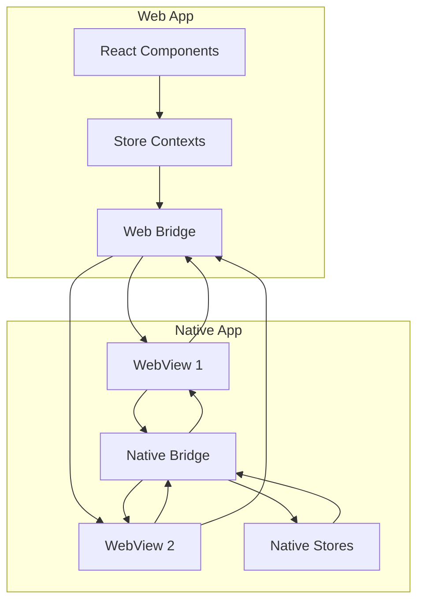
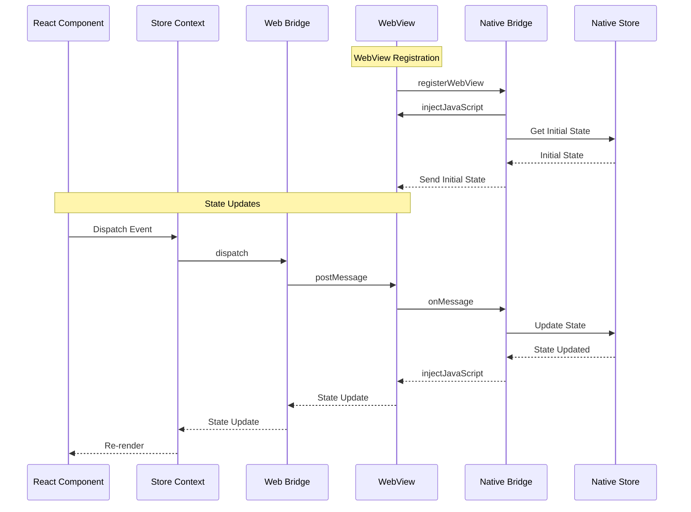
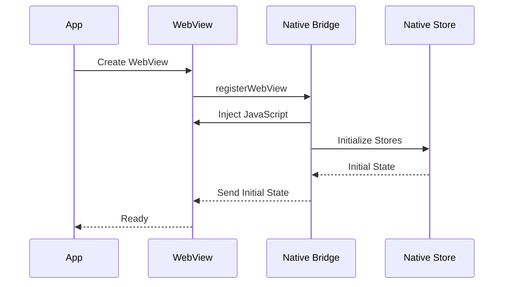
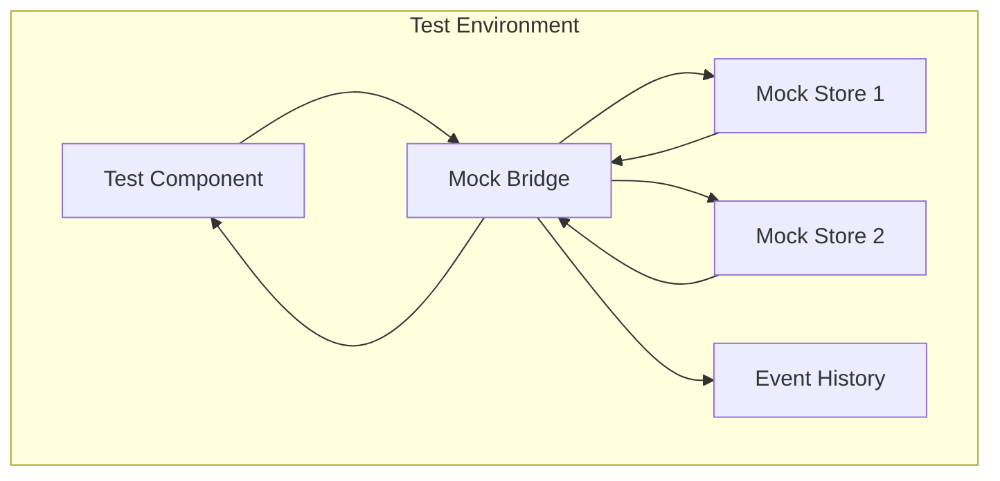

# 🏗️ Architecture

## Overview

The app-bridge package provides a type-safe bridge between web games and the OpenGame App. It manages state and events across the bridge boundary, ensuring type safety and proper initialization.

## System Design

### Core Components

### Communication Protocol

### Store Initialization Flow

## Implementation Details

### Bridge Implementation

The bridge is implemented as a state management system that:

1. Manages store initialization
2. Handles bi-directional communication through WebView
3. Provides type-safe event dispatch
4. Maintains store state consistency

### WebView Integration

The WebView integration provides:

1. **Registration**
   - Native app registers WebView with bridge
   - Bridge injects necessary JavaScript
   - Bridge sets up message handlers

2. **Message Passing**
   - Web side sends events via `postMessage`
   - Native side receives events via `onMessage`
   - Native side sends state updates via `injectJavaScript`

3. **State Synchronization**
   - Native side maintains source of truth
   - State updates are sent to web via WebView
   - Web side reflects state changes in UI

### React Integration

The React integration provides:

1. Context-based store access
2. Type-safe hooks for state and events
3. Initialization state handling
4. Support state management

### Error Handling

The system implements a layered error handling approach:

1. **Bridge Level**
   - Connection errors
   - Communication failures
   - State synchronization errors

2. **Store Level**
   - Initialization errors
   - State update failures
   - Event processing errors

3. **React Level**
   - Hook usage errors (when hooks are used outside of providers)
   - Context errors
   - Component rendering errors

## Testing Architecture

The testing architecture provides:

1. Mock bridge implementation that mimics the real bridge behavior
2. Individual mock stores with direct state manipulation
3. Event tracking for verifying dispatched events
4. State reset capabilities for test isolation
5. Support for testing initialization and error scenarios 

// Add example if any component name issues are found 