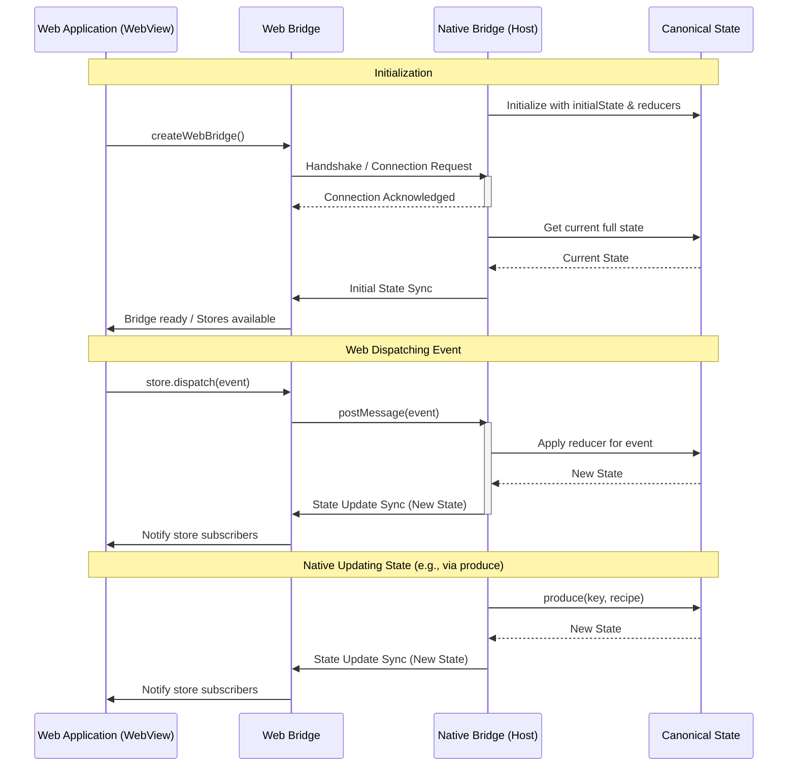

# OpenGame App Bridge Architecture

This document provides a high-level overview of the architecture for the `@open-game-system/app-bridge` library suite.

## Goals

- Provide a unified way to manage shared state between a native host application (React Native) and embedded web applications (WebViews).
- Offer distinct but compatible interfaces for native and web environments.
- Ensure type safety across the bridge using TypeScript.
- Isolate state management per feature using unique keys.
- Enable efficient state synchronization.

## Core Concepts

1.  **Bridge:** The central coordinator for communication and state.
2.  **Stores:** Keyed, feature-specific state containers. Each store has its own state and defined event types (`StoreDefinition`).
3.  **Native Bridge:** The implementation running in the React Native host application. It holds the canonical state and processes state-changing events using reducers.
4.  **Web Bridge:** The implementation running within the WebView. It receives state updates from the native bridge and sends events to it.
5.  **Synchronization:** State changes are synchronized from the native side to connected web views. The current mechanism relies on sending full state snapshots upon change, but could potentially be optimized with JSON patches in the future.
6.  **TypeScript-First:** The library focuses on providing strong types and interfaces, allowing consumers to rely on contracts rather than specific implementations.

## Package Breakdown

-   **`packages/core` (`@open-game-system/app-bridge`)**: Defines the fundamental types and interfaces (`Store`, `StoreDefinition`, `BridgeStores`, `Bridge`, `NativeBridge`) and core utilities like `produce`. It establishes the contract that other packages implement.
-   **`packages/web` (`@open-game-system/app-bridge-web`)**: Provides the `createWebBridge` function. This bridge runs inside the WebView, communicates with the native host (usually via `window.ReactNativeWebView.postMessage`), subscribes to state updates, and dispatches events back to the native side.
-   **`packages/react` (`@open-game-system/app-bridge-react`)**: Offers React integration components and hooks. It provides `createBridgeContext` to manage the bridge instance and `createStoreContext` to create type-safe contexts for individual stores. This layer simplifies interacting with the bridge and stores in React components.
-   **`packages/react-native` (`@open-game-system/app-bridge-react-native`)**: Provides the `createNativeBridge` function. This bridge runs in the React Native host application. It manages the actual state, applies reducers to handle events dispatched from web views or the native side, and sends state updates to connected WebViews. It also exposes the `produce` method for direct, type-safe state mutations on the native side.
-   **`packages/testing` (`@open-game-system/app-bridge-testing`)**: Contains utilities (`createMockBridge`, `createMockNativeBridge`, `createMockStore`) for testing components and applications that use the app-bridge, allowing for isolation and controlled testing environments.

## Communication Flow

1.  **Initialization:** The Native Bridge is created with initial state and reducers. The Web Bridge is created in the WebView and establishes a connection with the Native Bridge. The Native Bridge sends the initial state to the Web Bridge.
2.  **Web Event:** The Web App dispatches an event via a store. The Web Bridge sends this event to the Native Bridge. The Native Bridge applies the corresponding reducer, updates the canonical state, and sends the new state back to the Web Bridge.
3.  **Native Update:** The Native App directly updates state using `produce`. The Native Bridge updates the canonical state and sends the new state to the Web Bridge.
4.  **Notification:** In both update scenarios, the Web Bridge receives the new state and notifies its store subscribers, causing React components to re-render.

## Future Considerations

-   **Optimization:** Explore using JSON patches instead of sending the full state on every update, especially for large states.
-   **Error Handling:** Define more robust error handling and reporting mechanisms between the bridges.
-   **Bi-directional `produce`:** Consider if allowing `produce`-like updates initiated from the web side is desirable or feasible. 