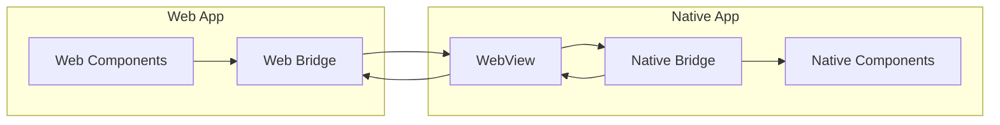
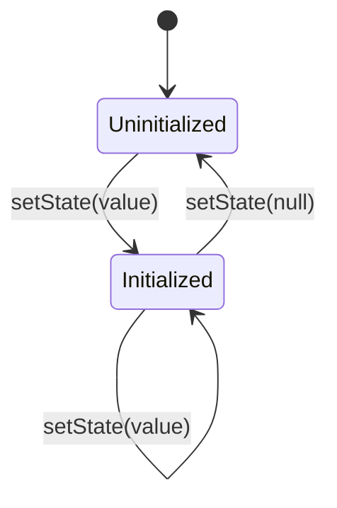

# 🎯 Core Concepts

## Bridge Pattern

The app-bridge package implements a bridge pattern to manage state and events between web games and the OpenGame App. This pattern provides:

1. Type-safe communication
2. State synchronization
3. Event handling
4. Initialization management



## Type System

The type system ensures type safety across the bridge:

```typescript
// shared/types.ts
export interface CounterState {
  value: number;
}

export type CounterEvents = 
  | { type: "INCREMENT" }
  | { type: "DECREMENT" }
  | { type: "SET"; value: number };

export type AppStores = {
  counter: {
    state: CounterState;
    events: CounterEvents;
  };
};
```

## WebView Integration

The bridge uses React Native's WebView for communication between web and native:

```typescript
// In React Native app
function GameWebView() {
  const webViewRef = useRef<WebView>(null);

  useEffect(() => {
    // Register the WebView with the bridge
    bridge.registerWebView(webViewRef.current);
  }, []);

  return (
    <WebView
      ref={webViewRef}
      source={{ uri: 'https://your-game-url.com' }}
      onMessage={(event) => {
        // Handle messages from the web side
        bridge.handleWebMessage(event.nativeEvent.data);
      }}
      injectedJavaScript={bridge.getInjectedJavaScript()}
    />
  );
}
```

The integration works in three steps:

1. **WebView Registration**
   - Native app registers the WebView with the bridge
   - Bridge injects necessary JavaScript into the WebView
   - Bridge sets up message handlers

2. **Message Passing**
   - Web side sends events via `postMessage`
   - Native side receives events via `onMessage`
   - Native side sends state updates via `injectJavaScript`

3. **State Synchronization**
   - Native side maintains source of truth
   - State updates are sent to web via WebView
   - Web side reflects state changes in UI

## Store Management

Stores are the core building blocks for state management. Each store has two states:

1. **Uninitialized**: Store is not yet ready (state is null)
2. **Initialized**: Store is ready for use (state has a value)



### Store Initialization

Store initialization is handled by the React Native host application:

```typescript
// In React Native app
const bridge = createNativeBridge<AppStores>({
  stores: {
    counter: {
      initialState: { value: 0 },
      reducers: {
        INCREMENT: (state) => {
          state.value += 1;
        }
      }
    }
  }
});

// Initialize stores when ready
bridge.setState('counter', { value: 0 }); // Initialize store
bridge.setState('counter', null); // Uninitialize store
```

## State Updates

State updates can happen in two ways:

1. **From Native Side**
   ```typescript
   // Direct state updates in native app
   bridge.produce('counter', draft => {
     draft.value += 1;
   });

   // Set state directly
   bridge.setState('counter', { value: 42 });

   // ⚠️ Warning: produce will throw in development if store is not initialized
   bridge.produce('uninitializedStore', draft => {
     draft.value += 1; // Throws in dev, warns in prod
   });
   ```

2. **From Web Side**
   ```typescript
   // In web app (WebView)
   webBridge.dispatch('counter', { type: 'INCREMENT' });
   
   // Native bridge handles the event
   const nativeBridge = createNativeBridge<AppStores>({
     stores: {
       counter: {
         initialState: { value: 0 },
         reducers: {
           INCREMENT: (state) => {
             state.value += 1;
           }
         }
       }
     }
   });
   ```

## React Integration

The React integration provides hooks and context for easy state management:

```typescript
// Create store context
const CounterContext = BridgeContext.createStoreContext('counter');

// Use in components
function Counter() {
  const value = CounterContext.useSelector(state => state.value);
  const dispatch = CounterContext.useDispatch();

  return (
    <div>
      <p>Count: {value}</p>
      <button onClick={() => dispatch({ type: "INCREMENT" })}>+</button>
    </div>
  );
}

// Handle initialization states
function App() {
  return (
    <BridgeContext.Supported>
      <CounterContext.Initializing>
        <div>Loading...</div>
      </CounterContext.Initializing>
      <CounterContext.Initialized>
        <Counter />
      </CounterContext.Initialized>
    </BridgeContext.Supported>
  );
}
```

## Testing

Testing with the bridge requires:

1. Mock bridge setup
2. State verification
3. Event simulation
4. Component testing

```typescript
// Create mock bridge
const mockBridge = createMockBridge<AppStores>({
  stores: {
    counter: {
      initialState: { value: 0 },
      reducers: {
        INCREMENT: (state) => {
          state.value += 1;
        }
      }
    }
  }
});

// Test component
test('Counter updates correctly', () => {
  render(
    <BridgeContext.Provider bridge={mockBridge}>
      <CounterContext.Initialized>
        <CounterComponent />
      </CounterContext.Initialized>
    </BridgeContext.Provider>
  );

  fireEvent.click(screen.getByText('+'));
  expect(screen.getByText('Count: 1')).toBeInTheDocument();
});
```

## Best Practices

1. **Type Safety**
   - Use shared types between web and native
   - Leverage TypeScript's type system
   - Keep types in a shared location

2. **State Management**
   - Initialize stores when ready
   - Handle uninitialized states
   - Use immer-style updates
   - Keep reducers pure

3. **React Integration**
   - Use context providers
   - Handle initialization states
   - Use selectors for performance
   - Keep components focused

4. **Testing**
   - Use mock bridge
   - Test initialization states
   - Test error cases
   - Keep tests focused