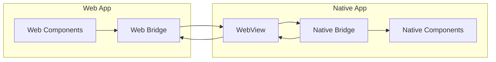
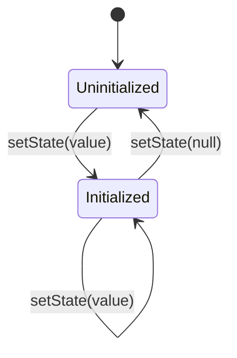
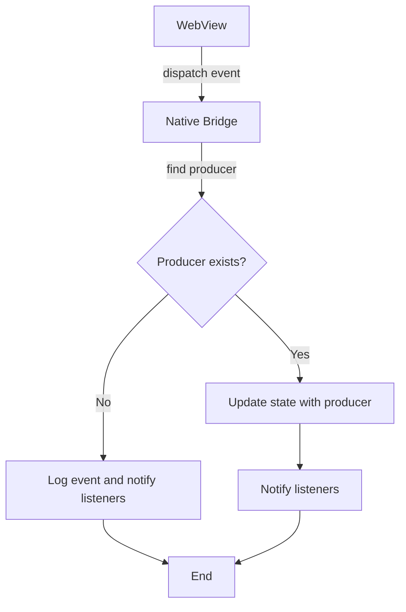

# 🎯 Core Concepts

## Bridge Pattern

The app-bridge package implements a bridge pattern to manage state and events between web games and the OpenGame App. This pattern provides:

1. Type-safe communication
2. State synchronization
3. Event handling
4. Initialization management



## Type System

The type system ensures type safety across the bridge:

```typescript
// shared/types.ts
export interface CounterState {
  value: number;
}

export type CounterEvents = 
  | { type: "INCREMENT" }
  | { type: "DECREMENT" }
  | { type: "SET"; value: number };

export type AppStores = {
  counter: {
    state: CounterState;
    events: CounterEvents;
  };
};
```

## WebView Integration

The bridge uses React Native's WebView for communication between web and native:

```typescript
// In React Native app
function GameWebView() {
  const webViewRef = useRef<WebView>(null);

  useEffect(() => {
    // Register the WebView with the bridge
    bridge.registerWebView(webViewRef.current);
  }, []);

  return (
    <WebView
      ref={webViewRef}
      source={{ uri: 'https://your-game-url.com' }}
      onMessage={(event) => {
        // Handle messages from the web side
        bridge.handleWebMessage(event.nativeEvent.data);
      }}
      injectedJavaScript={bridge.getInjectedJavaScript()}
    />
  );
}
```

The integration works in three steps:

1. **WebView Registration**
   - Native app registers the WebView with the bridge
   - Bridge injects necessary JavaScript into the WebView
   | Bridge sets up message handlers

2. **Message Passing**
   - Web side sends events via `postMessage`
   - Native side receives events via `onMessage`
   - Native side sends state updates via `injectJavaScript`

3. **State Synchronization**
   - Native side maintains source of truth
   - State updates are sent to web via WebView
   - Web side reflects state changes in UI

## Store Management

Stores are the core building blocks for state management. Each store has two states:

1. **Uninitialized**: Store is not yet ready (state is null)
2. **Initialized**: Store is ready for use (state has a value)



### Store Initialization

Store initialization is handled by the React Native host application:

```typescript
// In React Native app
const bridge = createNativeBridge<AppStores>({
  initialState: {
    counter: { value: 0 }
  }
});

// Initialize stores when ready
bridge.setState('counter', { value: 0 }); // Initialize store
bridge.setState('counter', null); // Uninitialize store
```

## State Updates

State updates can happen in two ways:

1. **From Native Side**
   ```typescript
   // Direct state updates in native app
   bridge.produce('counter', draft => {
     draft.value += 1;
   });

   // Set state directly
   bridge.setState('counter', { value: 42 });

   // ⚠️ Warning: produce will throw in development if store is not initialized
   bridge.produce('uninitializedStore', draft => {
     draft.value += 1; // Throws in dev, warns in prod
   });
   ```

2. **From Web Side**
   ```typescript
   // In web app (WebView)
   
   // First get a reference to the store
   const webBridge = createWebBridge<AppStores>();
   
   // Wait for store to be initialized by native side
   // Then get the store and dispatch events to it
   const counterStore = webBridge.getStore('counter');
   if (counterStore) {
     counterStore.dispatch({ type: 'INCREMENT' });
   }
   
   // Subscribe to state changes
   if (counterStore) {
     counterStore.subscribe(state => {
       console.log('Counter value:', state.value);
     });
   }
   
   // You can also listen for store availability changes
   webBridge.subscribe(() => {
     console.log('Store availability changed');
     const counterStore = webBridge.getStore('counter');
     if (counterStore) {
       console.log('Counter store is now available');
     }
   });
   ```

## Event Producers

Events sent from the web side to the native side are handled by producer functions. These producers are defined when creating the native bridge and are responsible for updating the state in response to events.

### Producer Definition

Producers are defined as an object with keys that match your store keys:

```typescript
const bridge = createNativeBridge<AppStores>({
  initialState: {
    counter: { value: 0 },
    user: { name: '', loggedIn: false }
  },
  producers: {
    // Counter store producer
    counter: (draft, event) => {
      // Handle counter events
      switch (event.type) {
        case 'INCREMENT':
          draft.value += 1;
          break;
          
        case 'DECREMENT':
          draft.value -= 1;
          break;
      }
    },
    
    // User store producer
    user: (draft, event) => {
      // Handle user events
      switch (event.type) {
        case 'LOGIN':
          draft.loggedIn = true;
          break;
          
        case 'LOGOUT':
          draft.loggedIn = false;
          break;
      }
    }
  }
});
```

### Producer Usage

When the web side dispatches an event, the bridge:
1. Identifies which store the event is for
2. Finds the producer for that store
3. If a producer exists, calls it with a draft state and the event
4. If no producer exists, logs the event and notifies listeners (without state change)



### Benefits of Producers

1. **Type Safety**: Each producer receives correctly typed state and events for its store
2. **Separation of Concerns**: Each store has its own producer function
3. **Immer Integration**: Use Immer's draft objects for intuitive state updates
4. **Event Handling**: Centralized, clean switch statements for handling different event types

### Type Safety in Producers

When defining your event types as discriminated unions with TypeScript, you get excellent type checking in your producers:

```typescript
// Define event types as discriminated unions
type CounterEvents = 
  | { type: 'INCREMENT' }
  | { type: 'DECREMENT' }
  | { type: 'SET'; value: number };  // value is required

// In your producer
counter: (draft, event) => {
  switch (event.type) {
    case 'INCREMENT':
      draft.value += 1;
      break;
    case 'SET':
      // TypeScript knows 'value' exists and is a number
      // No need for extra type guards
      draft.value = event.value;
      break;
  }
}
```

However, if you have optional properties in your event types, you will need type guards:

```typescript
// Event with optional property
type CounterEvents = 
  | { type: 'INCREMENT' }
  | { type: 'DECREMENT' }
  | { type: 'SET'; value?: number };  // value is optional

// In your producer
counter: (draft, event) => {
  switch (event.type) {
    case 'INCREMENT':
      draft.value += 1;
      break;
    case 'SET':
      // Type guard needed because value is optional
      if (event.value !== undefined) {
        draft.value = event.value;
      }
      break;
  }
}
```

Key points about type safety:
- TypeScript narrows the event type based on the `type` property when you use a switch statement
- Make sure your properties are required (not optional with `?`) to avoid needing extra type guards
- If you do have optional properties, use proper nullish checks (e.g., `if (event.value !== undefined)`)
- For complete type safety, consider making all event properties required wherever possible

## React Integration

The React integration provides hooks and context for easy state management:

```typescript
// Create store context
const CounterContext = BridgeContext.createStoreContext('counter');

// Use in components
function Counter() {
  const value = CounterContext.useSelector(state => state.value);
  const dispatch = CounterContext.useDispatch();

  return (
    <div>
      <p>Count: {value}</p>
      <button onClick={() => dispatch({ type: "INCREMENT" })}>+</button>
    </div>
  );
}

// Handle initialization states
function App() {
  return (
    <BridgeContext.Supported>
      <CounterContext.Loading>
        <div>Loading...</div>
      </CounterContext.Loading>
      <CounterContext.Provider>
        <Counter />
      </CounterContext.Provider>
    </BridgeContext.Supported>
  );
}
```

## Component Testing

The following example demonstrates how to test a component using the BridgeContext.Provider:

```typescript
// Test component
test('Counter updates correctly', () => {
  render(
    <BridgeContext.Provider bridge={mockBridge}>
      <CounterContext.Provider>
        <CounterComponent />
      </CounterContext.Provider>
    </BridgeContext.Provider>
  );

  fireEvent.click(screen.getByText('+'));
  expect(mockBridge.getHistory("counter")).toContainEqual({ type: "INCREMENT" });
});
```